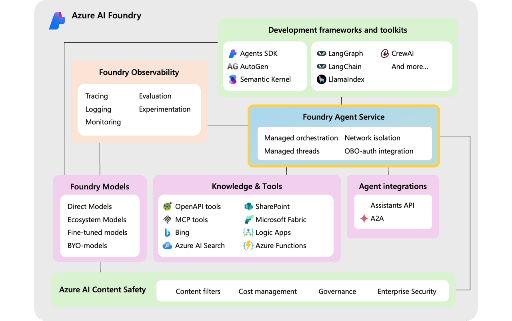

# Azure AI Agent Service Technical Enablement for HEXAWARE

This repository provides technical enablement resources, code samples, and demonstrations for HEWARE, focusing on leveraging the Azure AI Agent Service. The goal is to help teams understand, implement, and extend AI agent capabilities using Azure’s powerful AI and cloud services.

## Repository Structure

- **Jupyter Notebooks**  
  - `1 Azure AI Agent service - Single agent.ipynb`: Demonstrates how to create and interact with a single Azure AI agent.
  - `2 Azure AI Agent service - Many agents.ipynb`: Shows how to manage and interact with multiple agents.
  - `3 Azure AI Agent Service - File Search.ipynb`: Example of using an agent to search and process files.
  - `4 Azure AI Agent service - Code interpreter.ipynb`: Integrates code interpretation capabilities with Azure AI agents.
  - `5 Azure AI Agent service - Function calling.ipynb`: Demonstrates function calling with Azure AI agents.
  - `6 Azure AI Agent service - Bing integration.ipynb`: Shows how to integrate Bing search with Azure AI agents.

- **Configuration and Environment**
  - `azure.env`, `azure.env.sample`: Environment variable files for Azure credentials and configuration.

- **Documentation**
  - `README.md`: This file.

## Purpose

This repository is designed to accelerate technical enablement for HEWARE by providing hands-on examples, reusable code, and best practices for building intelligent agent solutions on Azure. It covers agent creation, orchestration, file search, code execution, external integrations, and more.

## Getting Started

1. Clone the repository.
2. Set up your environment variables using `azure.env.sample` as a template, and rename to azure.env or .env and modify notebooks accordingly.
3. Install required dependencies from `requirements.txt`.
4. Explore the Jupyter notebooks for step-by-step guides and code samples.

## License

This repository is intended ONLY for technical enablement and demonstration purposes.
